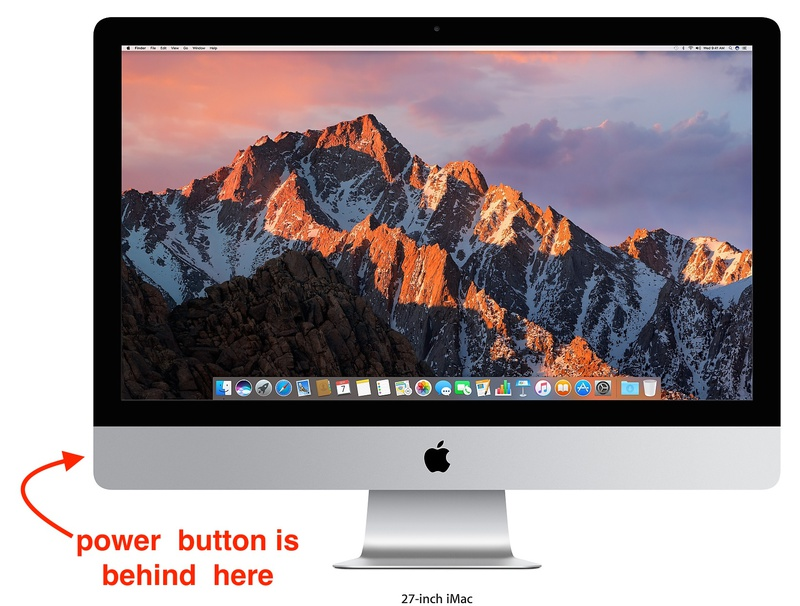

# Computer Literacy Lesson 1

[Chinese Mutual Aid Association](http://chinesemutualaid.org)

---
# Introduce yourself!

- What is your name?
- Where are you from?

---
# Survey questions

- What do you hope to learn in this class?
- Do you have a computer at home? If so, what kind?
- Is there someone at home who helps you with computers?

---

# What you need to bring

Paper for taking notes

That's it! We provide the computers.

---
# Please ask questions!

Don't be afraid to ask any question!

Your instructor and your fellow students are here to help you!

---
# Turning on the computer

The **power button** is on the back of the computer. Press it once to turn the computer on.

---
# Logging into the computer

- Make sure to log in as the "Student" user
- Ask the instructor for the password

---
# Adjusting the volume

Press  and  to adjust the volume.

---
# Open a web browser

From the **dock** at the bottom of the screen, click on Google Chrome.

---
# Visit this course's website

Click on the **address bar** in Google Chrome, type the following **URL**, and then press the `Return` key:

[ChineseMutualAid.github.io/computer-literacy/](http://chinesemutualaid.github.io/computer-literacy/)

---
# Go to Lesson 1

- Click on [Lesson 1](https://chinesemutualaid.github.io/computer-literacy/lesson-1/) to view the web page for this lesson.
- Click on [View slideshow](https://chinesemutualaid.github.io/computer-literacy/lesson-1/slides.html) to view the slideshow for this lesson.

---
# Using the slideshow

- Press ← and → keys to move through the slides
- The number of the slide is in the bottom right
- Links are [blue](https://google.com), you can click on them to open another web page

---
# Using the mouse

<a href='http://www.seniornet.org/howto/mouseexercises/placemouse1.html' class='external'>Start mouse exercises</a>

If you already feel comfortable using the mouse, then you can skip these exercises.

---
# Using the keyboard

<a href='http://www.bbc.co.uk/guides/z3c6tfr' class='external'>Start keyboard exercises</a>

Try to complete [Level 1](http://play.bbc.co.uk/play/pen/g8s4pb547b) of Dance Mat Typing

---
# Using bookmarks in the browser

We are going to show you how to **bookmark** a website so that you can easily visit it without needing to remember its URL.

There are a few steps to this process.

---
# Show the bookmarks bar

Click  in the upper right, then `Bookmarks`, and finally `Show Bookmarks Bar`

---
# Create a bookmark

Click  in the upper right, then `Done`

---
# Click the newly-created bookmark

The bookmark will appear in the **bookmark bar**. Create an empty tab and click the bookmark to prove it works.

---
# Homework assignment

If you have a computer at home, create bookmarks for these two websites:

- www.bbc.co.uk/guides/z3c6tfr
- chinesemutualaid.github.io/computer-literacy/

You can even make bookmarks on your smartphone! (Although the process is a little bit different.)

---
# The End

Yay! You completed the first lesson!
