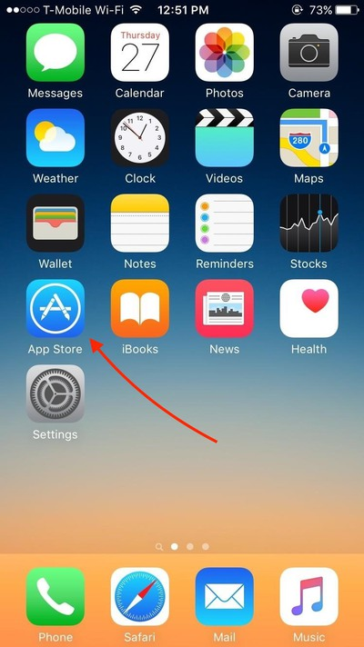

# Computer Literacy Lesson 4

[Chinese Mutual Aid Association](http://chinesemutualaid.org)

---
# What kind of smartphone do you have?

iPhone: Always has  on the back

Android: Almost every other kind of smartphone. Examples: Samsung, Nexus, LG, Motorola.

---
# Install Chrome on iPhone

Use `App Store` to find and install Google Chrome

---
# Install Chrome on Android

Use `Play Store` to find and install Google Chrome

---
# Visit a website

- If the address bar is gone, scroll up to make it appear
- Tap the address bar
- Type `chinesemutualaid.github.io` and then tap the `Go` button

---
# Add a bookmark

- Tap  in the upper right
- Tap  at the top

---
# Use a bookmark

- Tap  in the upper right
- Tap `Bookmarks`
- Tap the bookmark you just added

---
# Install Gmail on your smartphone

- On iPhone, use `App Store`
- On Android, use `Play Store`
- Search for "Gmail" and install it

---
# Read your mail

- When you open Gmail, you will see a list of emails
- Tap on any email to read its contents

---
# Send an email

- Tap  in the lower right corner
- Tap on `To`, and type the email address of one of your classmates
- Tap on `Subject` and type "Hello"
- Tap on `Compose email` and type "From my phone"
- Tap  in the upper right

---
# Reply to an email

- Find the email from your classmate
- Tap on the email
- Scroll to the bottom
- Tap `Reply` at the bottom
- Tap underneath the subject (looks like Re: Hello)
- Type "I got your email"
- Tap  in the upper right

---
# The End

Yay! You completed the course!
