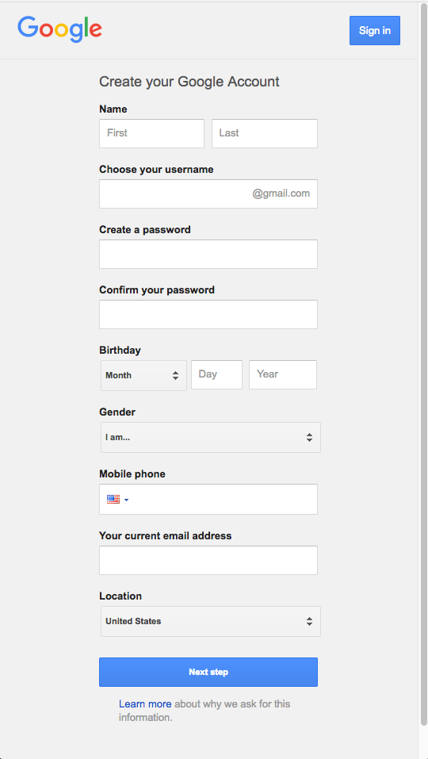

# Computer Literacy Lesson 2

[Chinese Mutual Aid Association](http://chinesemutualaid.org)

---
# Survey questions

- What do you hope to learn in this class?
- Do you have a computer at home? If so, what kind?
- Is there someone at home who helps you with computers?

---
# Review exercises

Create bookmarks for these websites:

- chinesemutualaid.github.io
- typing.com/student
- gmail.com

---
# Rename a bookmark, part 1

Right-click on your `typing.com` bookmark, and click `Edit...`

---
# Rename a bookmark, part 2

Change the name to just "Typing Lessons", then click `Save`.

---
# Create a Gmail account, part 1

Visit the Gmail page by clicking on your `gmail.com` bookmark. Click on `Create account`.

---
# Create a Gmail account, part 2

Fill out everything in the form, then click `Next step`

---
# Send an email

1. Click on `Compose`
2. Write the email address you want to send to
3. Write your subject
4. Write your message
5. Click `Send`

---
# Send some emails!

- Send an email to your instructor
- Send an email to a classmate
- Reply to an email

---
# Practice your typing

Click on your `typing.com` bookmark, and go through the exercises

---
# Homework assignment

Send an email to cmaa1702@googlegroups.com

---
# The End

Yay! You completed the second lesson!
