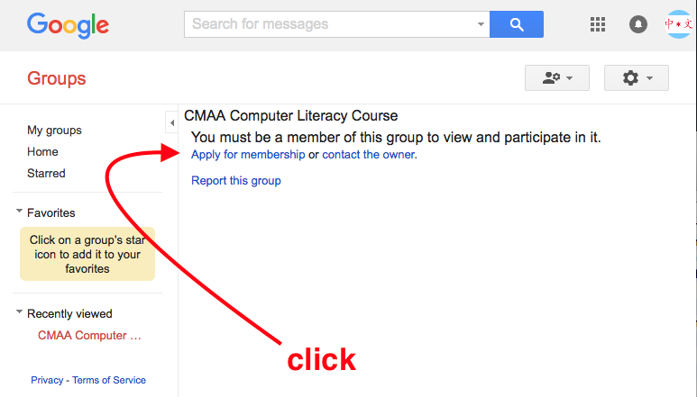
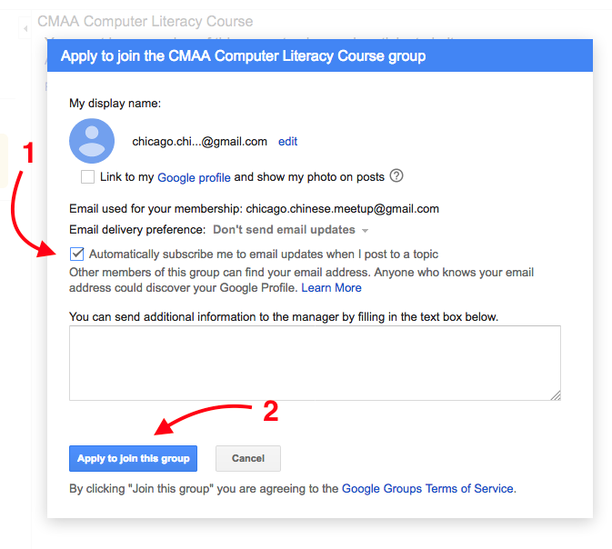

# Computer Literacy Lesson 3

[Chinese Mutual Aid Association](http://chinesemutualaid.org)

---
# Review exercises

- Send an email to a classmate
- Reply to an email that you received

---
# Join our mailing list, part 1

Visit the page for the <a href='https://groups.google.com/d/forum/cmaa-computer-literacy-course' class='external'>CMAA Computer Literacy Course mailing list</a>

---
# Join our mailing list, part 2

Click on `Apply for membership`

---
# Join our mailing list, part 3

Click on `Automatically subscribe me...` and then `Apply to join this group`

---
# Post messages to the mailing list

Send an email to:

`cmaa-computer-literacy-course@googlegroups.com`

Everyone subscribed to the mailing list will see your email!

---
# Don't forget to practice your typing!

<a href='http://typing.com/student' class='external'>typing.com/student</a>

You should already have a bookmark for this site

---
# Another free computer class

Register on March 2 or March 3

Class runs from March 6 to May 3

[More information](computer-classes-march-2017.pdf)

---
# The End

Yay! You completed the third lesson!
