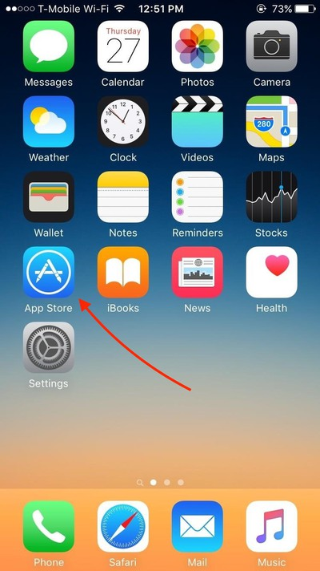
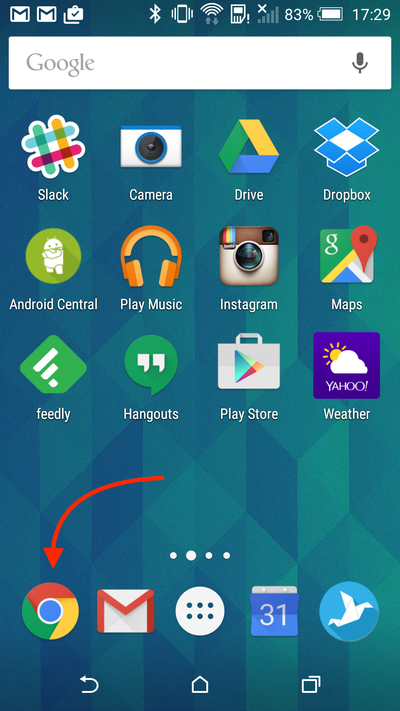
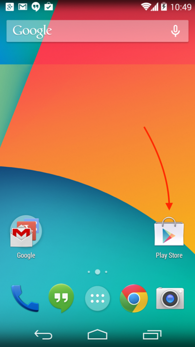

# Computer Literacy Lesson 4

[Chinese Mutual Aid Association](http://chinesemutualaid.org)

---
# What kind of smartphone do you have?

iPhone: Always has  on the back.

Android: Almost every other kind of smartphone. Examples: Samsung, Nexus, LG, Motorola.

---
# Google Chrome on your smartphone

- Works similarly to the desktop computer version
- Can be installed on every type of smartphone
- You can share bookmarks between the desktop version and the smartphone version

---
# Install Chrome on iPhone

Use `App Store` to find and install Google Chrome

---
# Install Chrome on Android

Android smartphones usually already have Chrome installed

---
# Drag Chrome to your dock

Because you will use it a lot, you should drag Chrome into the dock at the bottom of your home screen.

---
# Start Chrome

Tap the Chrome icon once to start it

---
# Visit a website

- Tap the address bar
- Type `chinesemutualaid.github.io` and then tap the `Go` button

Note: If the address bar is gone, scroll up to make it reappear

---
# Add a bookmark

- Tap  in the upper right
- Tap  at the top

---
# Use a bookmark

- Tap  in the upper right
- Tap `Bookmarks`
- Tap the bookmark you just added

---
# Gmail on your smartphone

- Can receive & send emails from your Gmail account
- Can be installed on every type of smartphone

---
# Install Gmail on iPhone

Use `App Store` to find and install Gmail

---
# Install Gmail on Android

Use `Play Store` to find and install Gmail

---
# Read your mail

- When you open Gmail, you will see a list of emails
- Tap on any email to read its contents

---
# Send an email

- Tap  in the lower right corner
- Tap on `To`, and type the email address of one of your classmates
- Tap on `Subject` and type 'Hello'
- Tap on `Compose email` and type 'From my phone'
- Tap  in the upper right

---
# Reply to an email

- Find the email from your classmate
- Tap on the email
- Scroll to the bottom
- Tap `Reply` at the bottom
- Tap underneath the subject (looks like Re: Hello)
- Type 'I got your email'
- Tap  in the upper right

---
# The End

Yay! You completed the course!
